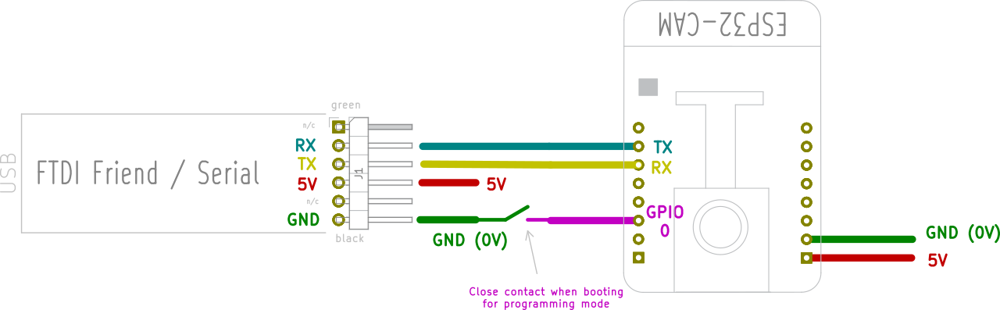
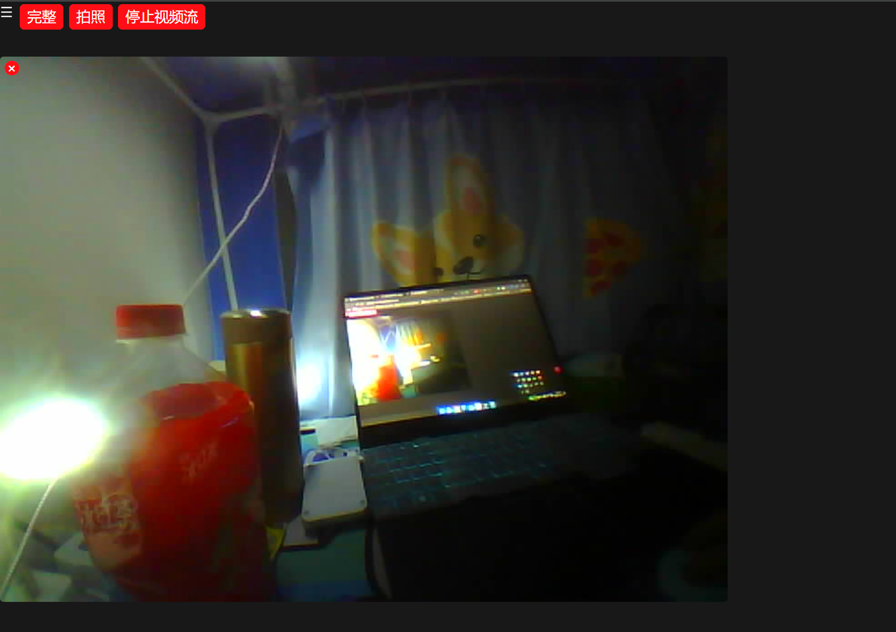
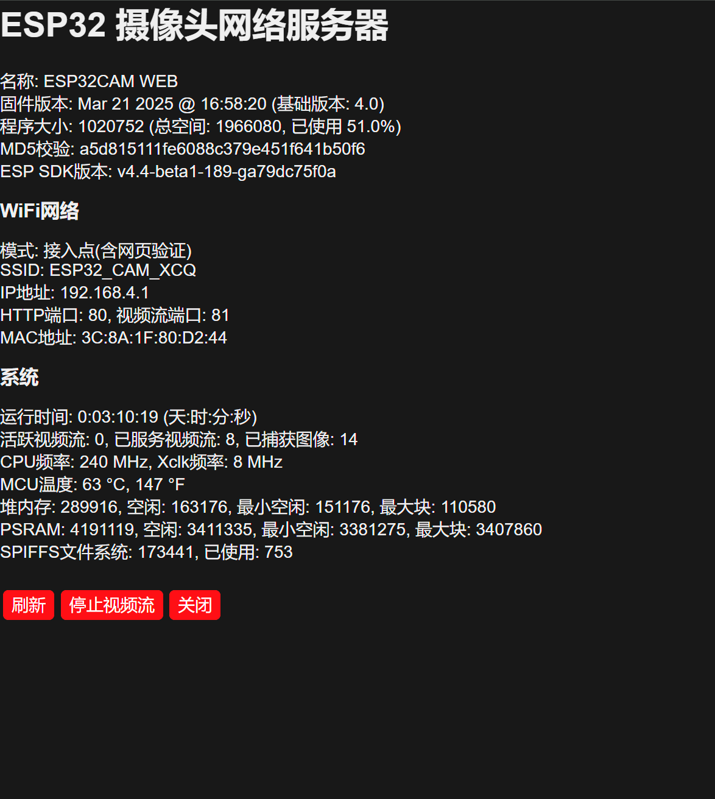

# ESP32-CAM 网络摄像头 (汉化版)

[](https://opensource.org/licenses/MIT)


<div align="center">
  
  <br>
  <h3>轻松构建自己的网络摄像头</h3>
</div>

[English Version (英文版)](README_EN.md) | **中文版**

## 📝 项目介绍

这是基于Espressif官方ESP32-CAM示例的增强版本，提供了完整的中文界面和增强功能。项目基于[easytarget/esp32-cam-webserver](https://github.com/easytarget/esp32-cam-webserver)进行汉化和功能改进，更加适合中文用户使用。

### 📸 主要特性

- **完整中文界面**：所有UI元素和控制面板均已汉化
- **实时视频流**：通过WiFi在浏览器中查看高质量视频流
- **拍照功能**：一键截取当前画面并保存
- **灯光控制**：调节摄像头LED灯亮度
- **图像设置**：调整分辨率、质量、亮度、对比度等参数
- **OTA更新**：支持无线固件更新
- **设置保存**：自动保存和恢复设置
- **视图旋转**：支持画面旋转以适应不同安装方式
- **独立流查看器**：提供简洁的独立视频流页面

## 🚀 快速开始

### 硬件需求

- ESP32-CAM开发板 (推荐AI-THINKER ESP32-CAM)
- USB-TTL适配器 (用于烧录固件，推荐CP2102或FTDI适配器)
- 5V电源供应
- 杜邦线若干

### 📋 准备工作

1. 下载并安装[Arduino IDE](https://www.arduino.cc/en/main/software)
2. 按照[此指南](https://docs.espressif.com/projects/arduino-esp32/en/latest/installing.html)配置ESP32开发环境
3. 下载本仓库代码
4. 根据需要修改`myconfig.sample.h`文件并保存为`myconfig.h`
5. 连接ESP32-CAM和USB-TTL适配器:
   - 适配器GND → ESP32-CAM GND
   - 适配器3.3V → ESP32-CAM 5V
   - 适配器TX → ESP32-CAM RX
   - 适配器RX → ESP32-CAM TX
   - 适配器GND → ESP32-CAM IO0 (仅编程时需要)



### 📥 烧录固件

1. 在Arduino IDE中打开项目
2. 选择开发板为`ESP32 Dev Module`
3. 分区方案选择`Minimal SPIFFS (1.9MB APP with OTA/190KB SPIFFS)`
4. 启用PSRAM
5. 按住ESP32-CAM上的RESET按钮，同时确保IO0接地
6. 释放RESET按钮，保持IO0接地
7. 点击Arduino IDE上传按钮
8. 上传完成后断开IO0与GND的连接并重置ESP32-CAM

### 📱 使用方法

1. 通过WiFi连接到ESP32-CAM创建的接入点(默认SSID:`ESP32-CAM-CONNECT`，密码:`InsecurePassword`)
2. 浏览器访问 http://192.168.4.1/
3. 使用网页界面控制摄像头

### ⚙️ 自定义配置

您可以通过创建`myconfig.h`文件来自定义设置:

```cpp
// 将此文件重命名为myconfig.h以设置自定义配置

// WiFi设置
#define WIFI_SSID "您的WiFi名称"
#define WIFI_PASS "您的WiFi密码"

// 摄像头名称
#define CAM_NAME "我的ESP32摄像头"

// 使用静态IP (可选)
#define USE_STATIC_IP
#define STATIC_IP "192.168.1.100"
#define STATIC_GW "192.168.1.1"
#define STATIC_SN "255.255.255.0"
```

## 📊 界面预览

### 主界面


### 流查看器



### 信息页面



## 🔧 故障排除

如果遇到问题:

1. 确保ESP32-CAM供电充足(建议使用5V/2A电源)
2. 检查连接是否正确，编程时IO0必须接地
3. 确保选择了正确的开发板和分区方案
4. 参阅[常见问题解答](https://randomnerdtutorials.com/esp32-cam-troubleshooting-guide/)

## 🔄 Android客户端应用

对于希望使用Android手机控制ESP32-CAM的用户，我们提供了专用的Android客户端应用:

👉 [ESP32-CAM WebCam App](https://github.com/XCQ0607/WebCam)

该应用提供了完整的中文界面，支持控制摄像头参数、拍照保存等功能。

## 🌟 相关项目

- 原始项目: [easytarget/esp32-cam-webserver](https://github.com/easytarget/esp32-cam-webserver)
- Android客户端: [XCQ0607/WebCam](https://github.com/XCQ0607/WebCam)
- 中文固件: [XCQ0607/esp32-cam-webserver-HAN](https://github.com/XCQ0607/esp32-cam-webserver-HAN)

## 📄 许可证

本项目基于MIT许可证开源。详见[LICENSE](LICENSE)文件。

## 🙏 致谢

感谢所有为ESP32-CAM开发做出贡献的开发者，特别是[easytarget](https://github.com/easytarget)提供的出色基础代码。

## Star History

[](https://www.star-history.com/#XCQ0607/esp32-cam-webserver-HAN&Date)