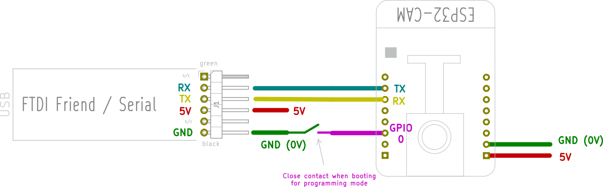
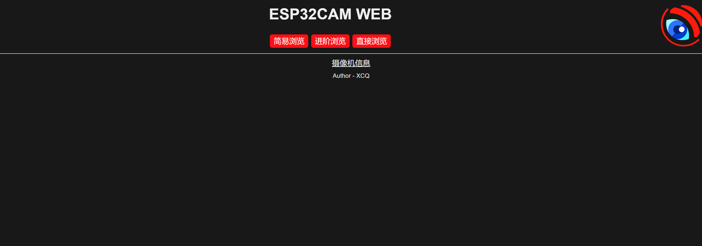
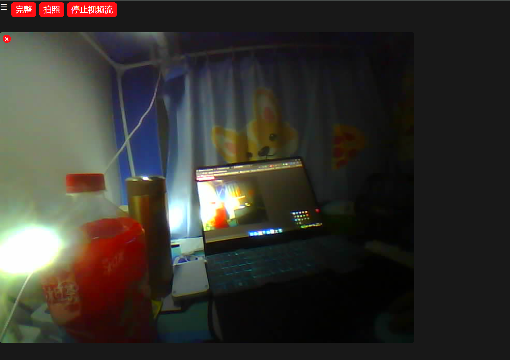
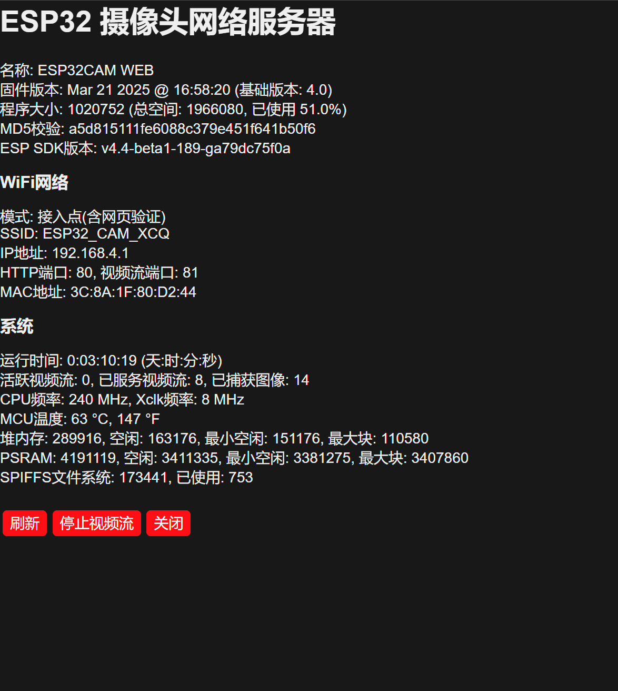

# ESP32-CAM Webserver (Chinese Version)

[](https://opensource.org/licenses/MIT)


<div align="center">
  
  <br>
  <h3>Build Your Own Webcam Easily</h3>
</div>

**English Version** | [中文版](README.md)

## 📝 Project Introduction

This is an enhanced version of the official Espressif ESP32-CAM example, providing a complete Chinese interface and enhanced features. The project is based on [easytarget/esp32-cam-webserver](https://github.com/easytarget/esp32-cam-webserver) with Chinese localization and functional improvements, making it more suitable for Chinese users.

### 📸 Main Features

- **Complete Chinese Interface**: All UI elements and control panels are localized in Chinese
- **Real-time Video Stream**: View high-quality video streams via WiFi in browser
- **Photo Capture**: One-click capture of current screen and save
- **Light Control**: Adjust the brightness of the camera LED light
- **Image Settings**: Adjust resolution, quality, brightness, contrast and other parameters
- **OTA Updates**: Support for wireless firmware updates
- **Save Settings**: Automatically save and restore settings
- **View Rotation**: Support screen rotation to adapt to different installation methods
- **Standalone Stream Viewer**: Provides a clean standalone video stream page

## 🚀 Quick Start

### Hardware Requirements

- ESP32-CAM development board (AI-THINKER ESP32-CAM recommended)
- USB-TTL adapter (for flashing firmware, CP2102 or FTDI adapter recommended)
- 5V power supply
- Several jumper wires

### 📋 Preparation

1. Download and install [Arduino IDE](https://www.arduino.cc/en/main/software)
2. Follow [this guide](https://docs.espressif.com/projects/arduino-esp32/en/latest/installing.html) to configure ESP32 development environment
3. Download this repository code
4. Modify the `myconfig.sample.h` file as needed and save as `myconfig.h`
5. Connect ESP32-CAM and USB-TTL adapter:
   - Adapter GND → ESP32-CAM GND
   - Adapter 3.3V → ESP32-CAM 5V
   - Adapter TX → ESP32-CAM RX
   - Adapter RX → ESP32-CAM TX
   - Adapter GND → ESP32-CAM IO0 (only needed during programming)



### 📥 Flashing Firmware

1. Open the project in Arduino IDE
2. Select `ESP32 Dev Module` as the board
3. Select `Minimal SPIFFS (1.9MB APP with OTA/190KB SPIFFS)` for partition scheme
4. Enable PSRAM
5. Hold the RESET button on the ESP32-CAM while ensuring IO0 is grounded
6. Release the RESET button, keeping IO0 grounded
7. Click the upload button in Arduino IDE
8. When upload is complete, disconnect IO0 from GND and reset ESP32-CAM

### 📱 Usage

1. Connect to the access point created by ESP32-CAM (default SSID: `ESP32-CAM-CONNECT`, password: `InsecurePassword`)
2. Visit http://192.168.4.1/ in your browser
3. Use the web interface to control the camera

### ⚙️ Custom Configuration

You can customize settings by creating a `myconfig.h` file:

```cpp
// Rename this file to myconfig.h to set custom configuration

// WiFi settings
#define WIFI_SSID "Your WiFi Name"
#define WIFI_PASS "Your WiFi Password"

// Camera name
#define CAM_NAME "My ESP32 Camera"

// Use static IP (optional)
#define USE_STATIC_IP
#define STATIC_IP "192.168.1.100"
#define STATIC_GW "192.168.1.1"
#define STATIC_SN "255.255.255.0"
```

## 📊 Interface Preview

### Main Interface



### Stream Viewer



### Information Page



## 🔧 Troubleshooting

If you encounter issues:

1. Ensure the ESP32-CAM has sufficient power (5V/2A power supply recommended)
2. Check that connections are correct, IO0 must be grounded during programming
3. Make sure the correct development board and partition scheme are selected
4. Refer to [FAQ](https://randomnerdtutorials.com/esp32-cam-troubleshooting-guide/)

## 🔄 Android Client Application

For users who want to control ESP32-CAM with Android phones, we provide a dedicated Android client application:

👉 [ESP32-CAM WebCam App](https://github.com/XCQ0607/WebCam)

The app provides a complete Chinese interface, supporting camera parameter control, photo saving and other functions.

## 🌟 Related Projects

- Original project: [easytarget/esp32-cam-webserver](https://github.com/easytarget/esp32-cam-webserver)
- Android client: [XCQ0607/WebCam](https://github.com/XCQ0607/WebCam)
- Chinese firmware: [XCQ0607/esp32-cam-webserver-HAN](https://github.com/XCQ0607/esp32-cam-webserver-HAN)

## 📄 License

This project is open-sourced under the MIT license. See [LICENSE](LICENSE) file for details.

## 🙏 Acknowledgements

Thanks to all developers who have contributed to ESP32-CAM development, especially [easytarget](https://github.com/easytarget) for providing the excellent base code. 